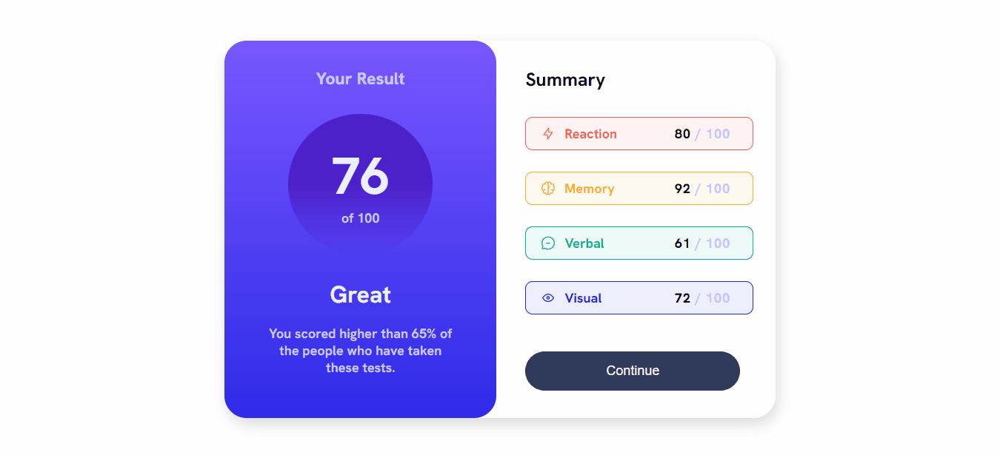

## Sobre
Esse é um projeto feito a partir de um desafio simples, pego no site Frontend Mentor, para praticar HTML e CSS, além de formas diferentes de estilização.
 
Como por exemplo formas de degradê com cores solidas.

## Projeto
